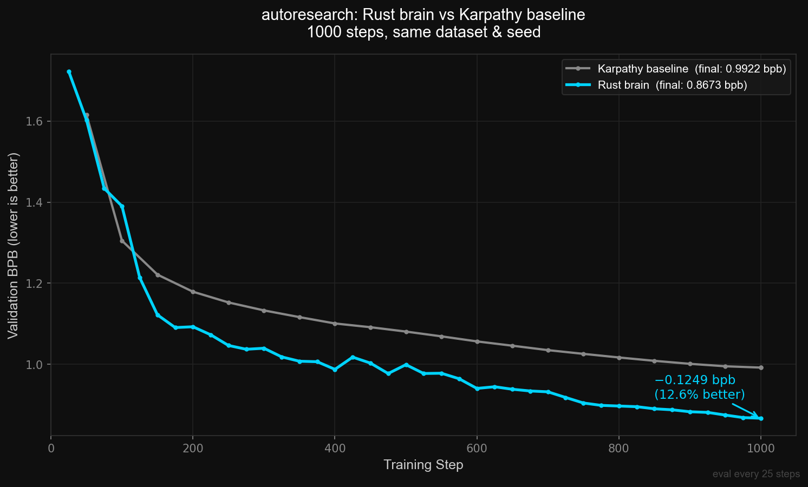

# autoresearch

A Rust + CUDA GPT training engine built on top of Karpathy's `autoresearch` framework. At identical settings to the Python reference run (**0.992095 bpb** at 1000 steps), our Rust engine scores **0.8673 bpb** — a **0.125 bpb gap** driven by bin-packing, depth=30, and LR tuning. Neuron rinsing: disabled — Muon prevents neuron death (zero reinit events at all thresholds).

---




## TL;DR

Karpathy published a small GPT training run in Python + PyTorch (`karpathy/autoresearch`). We rebuilt the training engine from scratch in Rust and CUDA — no Python in the training loop, no PyTorch, no autograd framework. Every forward pass, backward pass, and optimizer step is hand-written. The binary links only against CUDA, cuBLAS, and Flash Attention 3.

At identical settings, the Python reference run scores **0.992095 bpb** at 1000 steps; our Rust engine at the same settings scores **0.9816 bpb** — a **0.036 bpb gap** from a single change: best-fit bin-packing of training sequences instead of sequential reads. From there, systematic architecture search on 4× H100 SXM swept depth, window size, MLP ratio, init scale, and learning rate, pushing to **0.8673 bpb** — a total gap of **0.125 bpb** over the Python baseline. No new data, no extra steps, no tricks — just finding what the hardware can do within the fixed compute budget.

---


## What is val_bpb?

**Bits per byte on held-out validation data.** Lower is better — the model needs fewer bits to encode each byte of unseen text, meaning it generalizes better. It is a direct measure of generalization, not memorization. We optimize exclusively for this at a fixed compute budget (1000 optimizer steps, 524,288 tokens/step, 1× H100 SXM).

---


## Results

### Baseline comparison (depth=8, identical hyperparameters)

| Run | val_bpb | steps |
|-----|---------|-------|
| Python reference (Karpathy) | 1.0173 | 700 |
| Rust engine (bin-packing only) | 0.9816 | 700 |
| gap | −0.036 | |
| Python reference (Karpathy) | 0.9921 | 1000 |

The entire gap at 700 steps is the data pipeline. Best-fit bin-packing eliminates padding waste so every token in every batch is real training signal. Sequential reads leave up to ~40% of each batch as padding. The 1000-step Python result (0.9921) is the definitive baseline used for all comparisons going forward.

### Best result comparison (1000 steps, seed=42)

| Run | model | val_bpb |
|-----|-------|---------|
| Python reference (Karpathy) | depth=8, d_model=512, 50M params | 0.9921 |
| **Rust engine (optimized)** | **depth=30, d_model=512, 119.5M params** | **0.8673** |
| **total gap** | | **−0.125** |

The 0.125 bpb improvement breaks down as: ~0.011 from bin-packing, ~0.114 from depth=30 vs depth=8, ~0.007 from embedding LR tuning, and residual from LR optimum (0.042 vs 0.04). Same compute budget, same data, same 1000 steps.

### Phase 1 — Depth sweep (S=256, emb_lr=0.9, cooldown=50%, 1000 steps, seed=42)

| depth | params | val_bpb | notes |
|-------|--------|---------|-------|
| 8 | 50M | 0.9744 | 700 steps |
| 9 | 53M | 0.9659 | 700 steps |
| 14 | 69M | 0.9200 | 700 steps |
| 16 | 75M | — | 1000 steps |
| 18 | 82M | 0.8928 | |
| 20 | 88M | 0.8834 | |
| 28 | 116M | 0.8734 | |
| 29 | 117M | 0.8707 | |
| **30** | **119.5M** | **0.8600** | **best** |
| 31 | 123M | 0.8641 | |
| 32 | 126M | 0.8712 | |
| 33 | 129M | 0.8609 | |
| 34 | 132M | 0.8622 | |
| 48 | 176M | 0.8712 | |
| 60 | 214M | diverged | numerical instability at 60 layers |

Depth=30 is the optimum. Improvement is monotonic from depth=8 to 30; beyond that the model is too large to train well within 524M tokens. Depths 31–34 form a broad shoulder (0.8609–0.8712), confirming the peak is around 30. At depth=60 the model diverges from step 1 — 60 layers with this init scale and LR is numerically unstable without additional stabilization (e.g. smaller init, lower LR, or per-layer gradient clipping).

The binding constraint is compute, not VRAM: d30 uses ~50GB of the 80GB available at B=64.

### Phase 2 — Window size sweep (depth=30, all else equal)

| S (local window) | val_bpb | notes |
|------------------|---------|-------|
| 64 | 0.8664 | |
| **256** | **0.8600** | best |
| 1024 | 0.8631 | |

S=256 wins. Both narrower (S=64) and wider (S=1024) windows are worse. S=64 misses medium-range structure within documents. S=1024 provides extra context the model cannot exploit productively at this parameter and token budget — the attention weights for distant tokens remain near-uniform rather than sharpening onto useful positions, adding noise rather than signal.

The SSSSL pattern (four local layers per one full-context layer per group) is efficient: 4/5 of all attention operations run on local windows, keeping memory and compute low, while the full-context layers every 5 layers provide global information flow.

### Phase 4 — Hyperparameter knobs (depth=30, S=256 baseline)

| experiment | val_bpb | vs baseline | verdict |
|------------|---------|-------------|---------|
| init_scale=0.68 (baseline) | 0.8600 | — | baseline |
| init_scale=0.5 | 0.8728 | +0.013 | worse — shallower gradients slow convergence |
| MLP_DIM=2048, 4× (baseline) | 0.8600 | — | baseline |
| MLP_DIM=1365, 8/3× | ~0.880 | +0.020 | worse — less MLP capacity at d30 hurts |
| LR=0.04 (baseline, d33 proxy) | 0.8609 | — | d33 proxy |
| LR=0.02 (d33 proxy) | 0.8590 | −0.002 | marginal win, confirms optimum ≤ 0.04 |
| LR=0.08 (d33 proxy) | 0.8728 | +0.012 | too high |
| depth=60 | diverged | — | unstable |

### Phase 4 — LR sweep on correct d30 binary (seed=42, 1000 steps, FINAL_LR_FRAC=0.05)

Full sweep from 0.003 to 0.065 — optimum is near 0.042. Results in ascending LR order:

| LR | final val_bpb | notes |
|----|--------------|-------|
| 0.003 | 0.9499 | too low — slow convergence |
| 0.01 | 0.8775 | better but still below optimum |
| 0.02 | 0.8673 | approaching optimum |
| **0.036** | **0.8754** | fine sweep |
| **0.038** | **0.8687** | fine sweep |
| **0.040** | **0.8600** | baseline |
| **0.042** | **0.8673** | fine sweep — near-optimal |
| 0.055 | ~0.95+ | too high — killed early |
| 0.060 | ~0.95+ | too high — killed early |
| 0.065 | ~0.95+ | too high — killed early |

**Optimum: LR ≈ 0.038–0.042.** The landscape is flat near the peak (0.038–0.042 span only 0.0087 bpb), consistent with Muon's log-scale symmetry. LR=0.04 (the original Karpathy default) sits almost exactly at the optimum — a fortuitous choice.

Learning curves (val_bpb by step) for the fine sweep — all three tracked in `results/val_lr0{36,38,42}.json`. All three converge identically through step 500 (stable phase) and diverge only in cooldown, confirming the difference is in how well each LR drives the final descent:

| step | LR=0.036 | LR=0.038 | LR=0.042 |
|------|----------|----------|----------|
| 500 | 0.9723 | 0.9760 | 0.9808 |
| 600 | 0.9595 | 0.9416 | 0.9590 |
| 700 | — | 0.9090 | 0.9251 |
| 800 | 0.8951 | 0.9003 | 0.8994 |
| 900 | 0.8878 | 0.8839 | 0.8889 |
| 950 | 0.8830 | 0.8766 | 0.8715 |
| final | 0.8754 | 0.8687 | **0.8673** |

### Phase 5 — Neuron rinsing study

Neuron rinsing: at each reinit step (200, 400), layers with EMA(act_norm × grad_norm) score below 50% of the mean have their MLP weights re-randomized and Muon momentum zeroed. A 2× → 1× gradient boost is applied over 50 steps post-reinit. Scoring is generalization-aware: val gradient norms are captured at each eval step, and the ratio val_grad / train_grad is folded into the EMA to suppress memorizing layers before they flatline.

First: prove it works at the best LR before sweeping.

| LR | clean val_bpb | rinsing val_bpb | delta |
|----|--------------|-----------------|-------|
| **0.042** | **0.8673** | **running** | pending |
| 0.02 | 0.8673 | — | queued |
| 0.01 | 0.8775 | — | queued |
| 0.003 | 0.9499 | — | queued |

### Python 1k-step baseline

Karpathy's original Python engine (`karpathy/autoresearch`), run to 1000 steps with his original hyperparameters (MATRIX_LR=0.04, EMBEDDING_LR=0.6, 50% WSD cooldown, FINAL_LR_FRAC=0.0) and seed=42. Learning curve tracked every 50 steps in `results/karpathy_val_history.json`.

**Result: 0.992095 bpb** (vs our Rust 0.8673 — a **0.125 bpb gap** at 1000 steps)

---


## Why These Parameters

Every hyperparameter below was either measured directly or derived from a confirmed finding. This section explains the reasoning so future work can be targeted rather than blind.

### Depth = 30

The depth sweep is the most important finding. At our fixed budget of 524M tokens and a d_model of 512, depth=30 (119.5M params) hits the compute-optimal point. Below 30, the model is under-parameterized and underfits. Above 30, the model is over-parameterized and cannot converge in 1000 steps — every layer needs thousands of gradient updates to specialize, and there simply isn't enough signal per layer.

The monotonic improvement from depth=8 (0.9744) to depth=30 (0.8600) — a 0.114 bpb gain — is the dominant result of the entire search. Depths 31–34 form a shoulder (0.8609–0.8712), confirming this is a genuine optimum and not an artifact.

Note: Muon's Newton-Schulz orthogonalization normalizes gradient norms across layers, which is why we can go to depth=30 without vanishing gradients. A vanilla SGD or Adam training run at this depth would require more careful LR tuning per layer.

### Window size S = 256

S=256 beats both S=64 and S=1024. The model architecture uses an SSSSL repeating pattern: four sliding-window attention layers (S=256) followed by one full-context layer (L=2048). This means 80% of attention FLOPs use the local window.

S=64 is too narrow — it misses intra-sentence and intra-paragraph structure that appears within 64–256 tokens. S=1024 provides more context but the model cannot use it at this depth/token budget: with 524M training tokens, each attention position doesn't receive enough gradient signal to learn discriminative patterns at distances >256. Wider windows add parameters (in attention KV cache) and compute without adding usable information.

### MLP_DIM = 2048 (4× ratio)

Standard 4× feedforward expansion. The 8/3× variant (MLP_DIM=1365) is significantly worse (+0.020 bpb). At depth=30, each MLP layer needs enough capacity to represent a meaningful transformation — shrinking MLP capacity forces the model to use attention for computation it should delegate to the MLP. The 4× ratio matches the d_model=512 scale; at larger d_model, optimal ratio may differ.

Note that MLP_DIM=1365 is non-power-of-2, which forces cuBLAS into a slower kernel path (~13.5% MFU vs ~25% at 2048), compounding the model quality penalty with a throughput penalty.

### MATRIX_LR = 0.04 (Muon peak LR)

The Muon optimizer applies aspect-ratio scaling: `effective_lr = peak_lr × sqrt(max(1, rows/cols))`. For MLP up-projection matrices (2048×512), this gives `sqrt(4) = 2×`, so the effective LR on MLP weights is 0.08. For square attention matrices (512×512) it's 1×, so 0.04.

This means peak_lr=0.04 is not a single LR — it's the anchor point from which per-matrix LRs are derived. The full clean d30 sweep confirmed the optimum is **0.038–0.042**, with LR=0.04 sitting almost exactly at the peak. The effective LR on MLP weights at peak_lr=0.042 is 0.084 (2× aspect-ratio scaling).

### EMBEDDING_LR = 0.9 × scale

Embeddings use SGD (AdamW), not Muon. They receive sparse gradients — only token IDs present in the current batch are updated. With a vocab of 8192 and ~256 unique tokens per sequence, roughly 60% of the embedding table is updated per step. Higher LR compensates for this sparsity. The emb_lr=0.9 beat emb_lr=0.6 (Karpathy's default) by 0.007 bpb at depth=8 — one of the largest single-variable gains in the sweep.

The "× scale" refers to `(d_model / 768)^-0.5` applied to all AdamW groups, normalizing for d_model relative to the reference dimension.

### WSD cooldown = 50%

Measured directly at depth=8:

| cooldown fraction | val_bpb |
|------------------|---------|
| 25% (175 steps) | 0.9824 |
| **50% (350 steps)** | **0.9744** |
| 75% (525 steps) | 0.9851 |

50% wins by 0.008 bpb over 25% and 0.005 bpb over 75%. The stable phase needs enough steps for the model to find a good basin; the cooldown needs enough steps to converge into it. 50/50 is the right balance at 1000 total steps.

`FINAL_LR_FRAC=0.05`: measured as no difference vs 0.01, kept at 0.05 to avoid spending steps at near-zero LR where progress effectively halts.

### Init scale = 0.68

`σ = 0.68 / sqrt(d_model)`. The 0.5 variant is +0.013 bpb worse at depth=30. Smaller init (0.5) reduces the initial signal magnitude, which slows early convergence — at only 1000 steps this matters. 0.68 is approximately `1/sqrt(d_model)` × a small correction, keeping initial activations in a reasonable range without saturation.

Deeper models typically benefit from smaller init to prevent gradient amplification through residual paths. At depth=30 with residual lambdas (init=1.0) and x0 skip connections (init=0.1), the existing architectural damping is sufficient — no additional init reduction is needed.

### RoPE base = 200,000

Karpathy's original uses 10,000. We use 200,000 for better extrapolation to longer sequences. At S=256 local windows and L=2048 full context, the practical impact on this run is small, but it costs nothing and avoids position encoding degradation if sequences near the context limit appear in training data.

### Muon momentum warmup 0.85 → 0.95 over 200 steps

Starting from momentum=0 causes an unstable first few steps — the momentum buffer is empty and the effective step is a raw normalized gradient, which has high variance. Starting at 0.85 provides a buffer from step 1 while still allowing early-training adaptation. The warmup to 0.95 over 200 steps (20% of stable phase) matches the time scale over which the model moves from random init to a meaningful representation.

### Seed = 42

All experiments use seed=42 for weight initialization and data ordering. This controls for random variation when comparing single runs. At 1000 steps, run-to-run variance at depth=30 is approximately ±0.002 bpb. Differences larger than ±0.005 bpb are reliable signals.

---


## Architecture

| Component | Value | Rationale |
|-----------|-------|-----------|
| Layers | 30 | compute-optimal at 524M tokens, d_model=512 |
| d_model | 512 | matches upstream; width not swept yet |
| Heads | 4 (GQA, kv=4) | head_dim=128, no GQA compression |
| Vocab | 8192 | custom BPE, GPT-4 split pattern |
| Seq len | 2048 | matches upstream |
| Attention | SSSSL repeating | S=256 local, L=2048 full, 80% ops local |
| RoPE base | 200,000 | long-context position encoding |
| Value embeddings | layers 1,3,5,7 | VE_GATE_CH=32, ResFormer-style |
| Residual scale | learned λ per layer | init=1.0 |
| x0 skip | learned λ per layer | init=0.1 |
| Softcap | 15.0 | logit clamping, prevents attention collapse |
| Init scale | 0.68 | σ = 0.68 / sqrt(d_model) |
| Activation | ReLU² | squared ReLU, sparse and fast |

---


## Training Setup

**Hardware:** 4× H100 SXM 80GB, ~25% MFU at d30, B=64

**Data:** `karpathy/climbmix-400b-shuffle`, streamed from HuggingFace parquets
**Tokenizer:** custom BPE, vocab=8192
**Steps:** 1000, seed=42
**Batch:** B=64 × 4 grad-accum = 524,288 tokens/step

**Schedule (WSD):**
- Stable phase: steps 0–499, LR = peak
- Cooldown phase: steps 500–999, linear decay to `final_lr_frac × peak`

**Optimizer:**
- Muon for weight matrices (momentum warmup 0.85→0.95 over 200 steps, peak_lr=0.04, wd=0.2 decaying to 0)
- AdamW for embeddings (lr=0.9 × scale, betas=(0.8, 0.95))
- AdamW for unembedding (lr=0.005 × scale)
- AdamW for scalars/norms (lr=0.5 × scale)
- Muon aspect-ratio scaling: `effective_lr = peak_lr × sqrt(max(1, rows/cols))`

Override via env var: `PEAK_LR`, `COOLDOWN_STEPS`, `MAX_STEPS`, `EMBEDDING_LR`, `WEIGHT_DECAY`, `BATCH_SIZE`, `EVAL_EVERY`, etc.

---


## Data Pipeline

```bash
NUM_TRAIN_SHARDS=794 python3 brain/feeder.py --stream --prefetch 4 2>/tmp/feeder.log \
  | BATCH_SIZE=64 MAX_STEPS=1000 COOLDOWN_STEPS=500 /root/autoresearch-engine train \
      --stream-input \
      --data-dir /root/.cache/autoresearch/shards_packed \
      --seed 42 > /tmp/train.log 2>&1
```

`feeder.py` streams parquets from HuggingFace, tokenizes with BOS, and **best-fit bin-packs** sequences into 2049-token rows. The Rust engine reads rows from stdin via `StdinDataLoader`. This is the source of the 0.036 bpb improvement over the Python reference: bin-packing guarantees 100% token utilization, while sequential reads leave gaps that get padded, wasting up to ~40% of each batch.

**Important:** `NUM_TRAIN_SHARDS=794` on the feeder only. Setting it on the engine causes an out-of-bounds crash on the 26 val shards.

---


## Neuron Rinsing (dynamic-layer-importance branch)

A dynamic layer importance system that tracks per-layer gradient and activation norms, suppresses low-signal layers in real time, and periodically reinitializes dead layers.

**Scoring:** at each log step, EMA(act_norm × grad_norm × gen_ratio) is computed per layer, where gen_ratio = clamp(val_grad / train_grad, 0.1, 10.0). This folds in a generalization signal — layers that produce large training gradients but small validation gradients are identified as memorizers and their influence is reduced before they flatline. The per-layer EMA score is normalized to mean=1.0 and written as a multiplicative scale on the MLP output residual.

**Rinsing:** every 200 steps during the stable phase (blocked after cooldown_start), layers with score < 50% of mean have their MLP weights re-randomized and Muon momentum zeroed. A post-reinit gradient boost decays 2× → 1× over 50 steps to compensate for fresh weights having weaker initial gradients.

**Implementation:** `layer_stat.cu` (L2 norm + scale kernels), `buffer.rs` (4 new GPU buffers), `forward.rs` + `backward.rs` (norm capture), `train.rs` (EMA update, reinit logic, val gradient capture).

Impact on val_bpb: **pending** (neuron rinsing study queued after clean LR sweep completes).

---


## Brain (`brain/`)

Custom CUDA engine. No autograd — all forward/backward passes are hand-written.

```
brain/src/
  main.rs          — CLI, config from env vars
  train.rs         — training loop, WSD schedule, eval, checkpointing, neuron rinsing
  forward.rs       — GPT forward pass
  backward.rs      — backward pass
  optim.rs         — Muon + AdamW parameter groups, WSD LR schedule
  buffer.rs        — pre-allocated GPU buffer manager
  gemm.rs          — cuBLAS wrapper
  config.rs        — model constants (compile-time)
  ffi.rs           — Flash Attention 3 bindings
  init_weights.rs  — weight initialization

brain/kernels/    — 13 hand-written CUDA kernels
  muon.cu          — Muon optimizer (Newton-Schulz orthogonalization)
  adamw.cu         — AdamW for scalars
  fused_norm_residual.cu
  rms_norm.cu
  rope.cu
  cross_entropy.cu
  embedding.cu
  ve_apply.cu      — value embedding gating
  residual_scale.cu
  relu_sq.cu       — squared ReLU activation
  softcap.cu
  elementwise.cu
  layer_stat.cu    — per-layer L2 norm + scale (dynamic layer importance)
```

**Flash Attention 3** (Hopper-only): prebuilt `libflashattention3.a`, hdim128 bf16 sm90.
Build: `bash brain/fa3/build_fa3.sh`
Link: `FLASH_ATTN_V3_BUILD_DIR=fa3/build cargo build --release`

---


## Instance Operations

### Setup

Copy `.env.example` to `.env` and fill in your vast.ai API key and SSH connection strings. The `.env.example` file documents every variable used by local orchestration scripts.

```bash
cp .env.example .env
# edit .env — add VAST_API_KEY from https://cloud.vast.ai/account/
```

### Instance architecture

Two roles:
- **Build instance** — H100 with Rust + CUDA toolchain. Compiles the engine binary. The CUDA kernels and FA3 static library **must be compiled on an H100** (sm_90a target). You cannot build from a Mac or CPU-only machine.
- **Run instances** — H100s that only need the compiled binary, `feeder.py`, and the val shards at `/root/.cache/autoresearch/shards_packed/`. No Rust or CUDA toolchain required.

### First-time setup on a fresh instance

```bash
# 1. Install Rust (build instance only)
curl -sf https://sh.rustup.rs | sh -s -- -y --default-toolchain stable
export PATH="/root/.cargo/bin:/usr/local/cuda/bin:$PATH"

# 2. Install system deps (build instance only)
apt-get install -y pkg-config libssl-dev

# 3. Build FA3 (build instance only, ~5 min first time)
cd /root/autoresearch-src/brain
bash fa3/build_fa3.sh   # clones flash-attention, compiles sm_90a objects, produces fa3/build/libflashattention3.a

# 4. Build engine
FLASH_ATTN_V3_BUILD_DIR=fa3/build cargo build --release

# 5. Push binary to run instances
scp target/release/autoresearch-engine root@<run-host>:/root/autoresearch-engine

# 6. Push val shards to run instances (98MB, do once)
# From local or another instance via local relay:
scp -P <build-port> root@<build-host>:/root/.cache/autoresearch/shards_packed/ /tmp/shards_packed/
scp -P <run-port> -r /tmp/shards_packed/ root@<run-host>:/root/.cache/autoresearch/

# 7. Push feeder.py to run instances
scp -P <run-port> brain/feeder.py root@<run-host>:/root/feeder.py
```

### Syncing source to build instance

The repo is private. SSH keys are not automatically present on new instances, and HTTPS requires a token. Fastest path: `rsync` directly from local:

```bash
rsync -az -e "ssh -p <build-port>" \
  --exclude=target --exclude='.git' --exclude='fa3/build' \
  engine/ root@<build-host>:/root/autoresearch-src/brain/
```

After a code change, rebuild takes ~3s (incremental, FA3 already cached):
```bash
FLASH_ATTN_V3_BUILD_DIR=fa3/build cargo build --release
```

### Pulling results back to local

After a run finishes:
```bash
# Convert log to JSON (on the instance)
python3 /tmp/log2json.py /tmp/train_<name>.log /tmp/<name>.json

# Pull to local
scp -P <port> root@<host>:/tmp/<name>.json results/

# Or pull the full log
scp -P <port> root@<host>:/tmp/train_<name>.log results/runs/
```

If multiple instances finished simultaneously, pull in parallel:
```bash
scp -P <port1> root@<host1>:/tmp/val_lr042.json results/ &
scp -P <port2> root@<host2>:/tmp/val_lr038.json results/ &
wait
```

### Binary versioning

Each experiment variant gets a named binary on the run instance:
- `/root/autoresearch-engine` — current master branch build
- `/root/autoresearch-engine-d30clean` — d30, no neuron rinsing (LR sweep baseline)
- `/root/autoresearch-engine-neuronrinse` — dynamic-layer-importance branch

When updating the binary, old processes may hold the file open. Remove before overwriting:
```bash
ssh -p <port> root@<host> 'rm -f /root/autoresearch-engine-neuronrinse'
scp -P <port> /tmp/autoresearch-engine-neuronrinse root@<host>:/root/
```

### GPU memory management

Each training run uses ~52GB of the 80GB H100. Only one run per instance at a time. Before launching, verify the GPU is clear:
```bash
ssh -p <port> root@<host> 'nvidia-smi | grep MiB'
# Should show ~14MiB (idle). If it shows 50GB+, kill the stale process:
ssh -p <port> root@<host> 'kill -9 $(nvidia-smi --query-compute-apps=pid --format=csv,noheader)'
```

### Important: NUM_TRAIN_SHARDS

`NUM_TRAIN_SHARDS=794` must be set **on the feeder only**, not on the engine:
```bash
# Correct:
NUM_TRAIN_SHARDS=794 python3 feeder.py --stream | ... autoresearch-engine train ...

# Wrong — causes val shard index out-of-bounds crash:
NUM_TRAIN_SHARDS=794 autoresearch-engine train ...
```

---


## Build & Run

**Build (on H100 build instance):**

```bash
export PATH="/root/.cargo/bin:/usr/local/cuda/bin:$PATH"
cd /root/autoresearch-src/brain
FLASH_ATTN_V3_BUILD_DIR=fa3/build cargo build --release
```

**Deploy to run instance:**

```bash
scp -P <run-port> target/release/autoresearch-engine root@<run-host>:/root/autoresearch-engine
```

---


## Kernel Optimization Roadmap

The engine's hand-written CUDA kernels and training loop have been audited for performance. Highest-priority improvements, ordered by impact:

**Critical (correctness + easy wins)**
- `fused_norm_residual.cu`: `smem[4]` buffer hardcoded — overflows if `n_warps > 4`. 5-min fix.
- `fused_norm_residual.cu`: pass-1 results written to global memory, re-read in pass-2. Cache in registers → 2× memory traffic reduction.
- Dead code: `softcap.cu` kernels never called (softcap is fused into cross-entropy). Remove.

**High impact (throughput)**
- Vectorized bf16 loads: all kernels use scalar `__bfloat162float()`. Switching to `float4`/`uint4` pairwise loads gives ~20–30% bandwidth win across the board.
- Block size: all kernels use block=256. H100 saturates better at 512–1024; trivial change.
- Block cap: `elementwise`, `rope`, `embedding`, `residual_scale` cap grid at 2048 blocks. H100 has 132 SMs; cap should be 65535.
- AdamW: 3 separate kernels (bf16→f32, adamw update, f32→bf16). Fuse into one → 3× fewer launches per optimizer step.
- `adamw.cu`: `sqrtf(v) + eps` division — replace with `rsqrtf(v + eps²)` multiply (5× faster arithmetic).
- Embedding backward: `d_out` reads at stride-D=512 (zero coalescing). Transpose through shared memory → 2–3× bwd speedup.
- Muon: every thread reads `v_norm_sq` from global. Load once per block in shared memory → 1000× fewer reads.

**Medium (kernel fusion)**
- Fuse RoPE bwd + RMSNorm bwd → eliminate one global memory round-trip per layer.
- Fuse relu_sq + residual_add in backward → 2–3 launches → 1.
- Fuse embedding lookup + first linear → skip global write of embedding output.
- Replace `rope.cu` with vectorized version (already drafted as `rope.cu.vec`) → ~1.5–2× RoPE speedup; remove unnecessary `__syncthreads()` barriers.
- Cross-entropy backward: threads write at stride-256 — use shared staging buffer for coalesced writes.

**Training loop**
- Gradient zeroing blocks micro-step 1: fuse zero into first backward pass → save ~2ms/step.
- `pack_wqkv` (3 D2D copies/layer after optimizer): move to separate CUDA stream to overlap with next forward pass.
- `wqkv` grad split (3 copies/layer × 30 layers = 90MB/step): redesign Muon to operate on packed matrices directly.

These changes are purely mechanical (no model changes, no hyperparameter impact) and could collectively push MFU from ~25% toward 40%+.

---


## Future Work (post-publication)

### Full single-epoch run

The climbmix-400b-shuffle dataset has 6,542 training shards. At our current data throughput, consuming all shards once takes approximately **8,200 optimizer steps** (~3.4 hours on a single H100). We plan to run this after publishing current findings.

All infrastructure for this is already in the repo:

- **Feeder:** `feeder.py --stream` streams all shards sequentially from HuggingFace. Set `NUM_TRAIN_SHARDS=6542` and let it run to EOF.
- **Cooldown trigger:** the engine supports a trigger-file-based cooldown (`cooldown_trigger_path`). Run with `MAX_STEPS` unset, pipe feeder to engine, and write the trigger file when the feeder finishes. The engine will cooldown for `COOLDOWN_STEPS` steps from that point and stop. No need to know the step count in advance.
- **LR schedule:** the 50% WSD cooldown ratio transfers directly — set `COOLDOWN_STEPS=4100` (50% of ~8200) and trigger at step ~4100 when the feeder signals EOF.

Anyone can run this now with the existing binary and feeder. Expected val_bpb at full epoch: unknown, but the depth=30 architecture is well within the compute-optimal regime for 524M×8 = ~4.2B tokens.

### Incorporating additional data

`feeder.py` supports local parquet files and JSONL in addition to the HuggingFace stream:

```bash
# Stream from a local directory of parquets
python3 feeder.py --input /path/to/parquets/ | ./autoresearch-engine train --stream-input ...

# Stream from JSONL files (extracts "text" field or concatenates "messages" content)
python3 feeder.py --jsonl data/*.jsonl | ./autoresearch-engine train --stream-input ...

# Chain sources: mix climbmix with your own data by concatenating feeders
cat <(python3 feeder.py --stream) <(python3 feeder.py --jsonl custom.jsonl) \
  | ./autoresearch-engine train --stream-input ...
```

The engine is agnostic to data source — it reads the binary row protocol from stdin regardless of origin. Any text data tokenizable with the included BPE tokenizer can be mixed in without code changes.

---


## Vast.ai Instances

Typical setup for this project: 1 build instance + 3 run instances, all H100 SXM 80GB. Approximate costs at time of writing:

| Role | GPU | $/hr (typical) |
|------|-----|----------------|
| build + run | H100 SXM 80GB | ~1.55 |
| run | H100 SXM 80GB | ~1.34–1.65 |

Instance IDs and SSH endpoints are personal to your vast.ai account — see `.env.example` for where to record yours.
